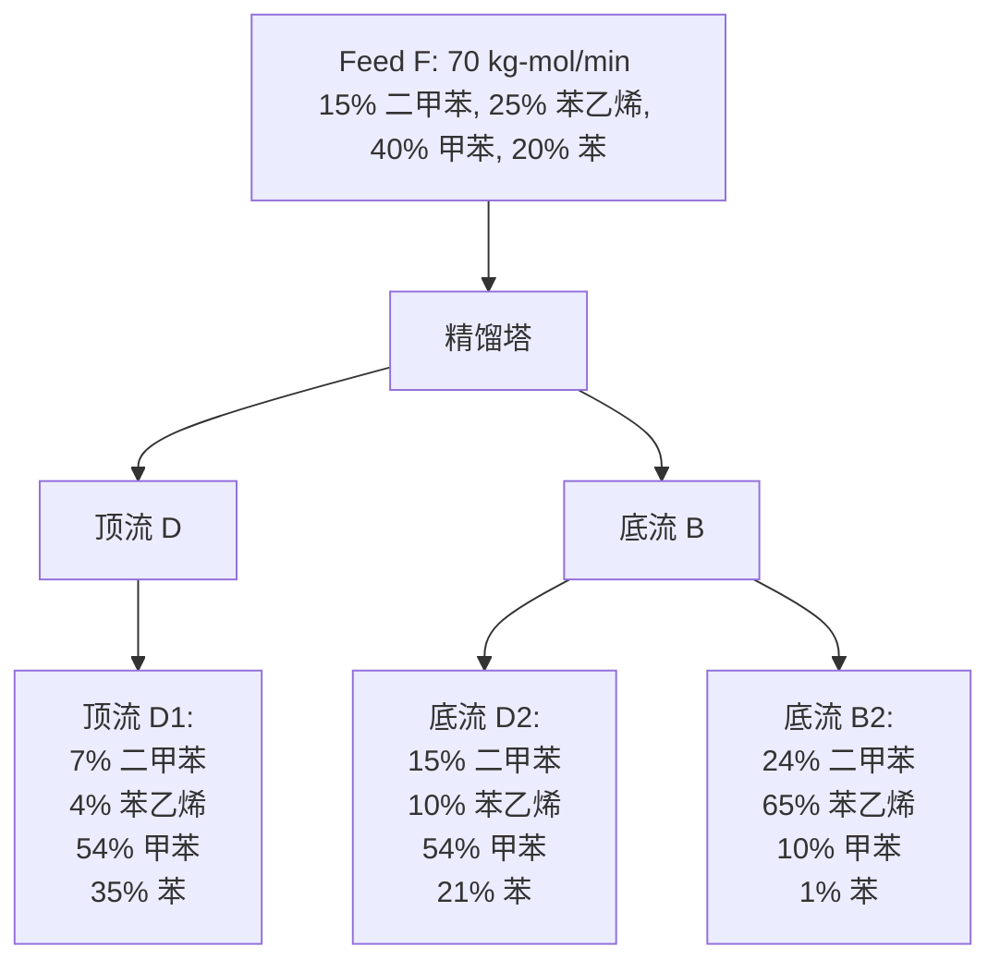

# 第二次作业

## 数值积分

### 问题描述

计算氯仿-苯双组分精馏系统中精馏段理论板数。已知气液平衡数据，进料和塔顶组成，以及精馏段的回流比。

### 求解思路

- 使用插值方法得到 $x_f=0.4$ 和 $x_d=0.9$ 处的 $y$ 值。
- 使用 `trapz` 和 `ty_integral` 方法分别计算理论板数。

### Mworks 程序

```julia
using TyBase, TyMath, Printf

# 气液平衡数据
x = [0.178, 0.275, 0.372, 0.456, 0.650, 0.844]
y = [0.243, 0.382, 0.518, 0.616, 0.795, 0.931]

# 插值获取 x_f 和 x_d 对应的 y 值
y_f = interp1(x, y, 0.4)
y_d = interp1(x, y, 0.9, "linear", "linear")

# 使用 trapz 方法
x_range = range(0.4, stop=0.9, length=1000)
y_values = interp1(x, y, x_range, "linear")
integrand = 1 ./ (y_values .- x_range .- (0.9 .- y_values) ./ 5)
N_trapz = trapz(x_range, integrand)

# 使用 ty_integral 方法
p = polyfit(x, y, 2) # p 是一个元组，其中第一个元素是多项式系数
coefficients = p[1] # 提取多项式系数
integrand_poly(x) = 1 / (polyval(coefficients, x) - x - (0.9 - polyval(coefficients, x)) / 5)
N_ty_integral = ty_integral(integrand_poly, 0.4, 0.9)

# 确保 N_trapz 和 N_ty_integral 是标量
if isa(N_trapz, Matrix) && size(N_trapz) == (1, 1)
    N_trapz = N_trapz[1]
end

if isa(N_ty_integral, Matrix) && size(N_ty_integral) == (1, 1)
    N_ty_integral = N_ty_integral[1]
end

@printf("使用 trapz 方法计算得到的理论板数为： %.2f\n", N_trapz)
@printf("使用 ty_integral 方法计算得到的理论板数为： %.2f\n", N_ty_integral)
```


```julia
运行结果如下：

julia> 正在运行 T1.jl
使用 trapz 方法计算得到的理论板数为： 4.75
使用 ty_integral 方法计算得到的理论板数为： 4.64
```

### 结果讨论

在数值积分中，使用`trapz`方法和`ty_integral`方法得到的理论板数略有差异。这种差异主要来源于数值积分方法的不同。`trapz`方法基于梯形规则进行积分，它是一种简单的数值积分技术，适用于数据点较多且分布均匀的情况。而`ty_integral`方法可能使用了更高级的积分技术，如辛普森规则或高阶多项式拟合，这可以提供更精确的积分结果。

此外，插值的精度也会影响积分结果。因为气液平衡数据在给定范围内是离散的，我们需要对其进行插值以获得连续的函数，用于积分计算。插值方法的选择（线性、多项式等）和插值点的数量都会影响最终的积分精度。

总体来说，两种方法得到的结果相近，表明在此问题上使用这两种数值积分方法都是可行的。但是，如果需要更高的精度，可能需要考虑使用更高阶的插值和积分方法，或者增加数据点的密度。

## 线性方程组的求解

### 问题描述

计算精馏塔在稳态操作时，D1, B1, D2 和 B2 的摩尔流量以及物流 D 和 B 的组成。

相应流程示意图如下



### 求解思路

- 建立物料衡算的数学模型。
- 将物料衡算转化为线性方程组。
- 使用 Mworks 解线性方程组。

### Mworks 程序

```julia
using TyBase, TyMath

# 已知变量
F = 70.0  # 进料流量 (kg-mol/min)
x_feed = [0.15, 0.25, 0.40, 0.20]  # 进料中各成分的摩尔分数: [二甲苯, 苯乙烯, 甲苯, 苯]

# 各支流成分的摩尔分数
x_D1 = [0.07, 0.04, 0.54, 0.35]
x_B1 = [0.24, 0.42, 0.16, 0.18]
x_D2 = [0.15, 0.10, 0.54, 0.21]
x_B2 = [0.24, 0.65, 0.10, 0.01]

# 计算各成分的进料量
b = F .* x_feed  # [10.5, 17.5, 28.0, 14.0]

# 系数矩阵 A
A = [
    x_D1[1]  x_B1[1]  x_D2[1]  x_B2[1]
    x_D1[2]  x_B1[2]  x_D2[2]  x_B2[2]
    x_D1[3]  x_B1[3]  x_D2[3]  x_B2[3]
    x_D1[4]  x_B1[4]  x_D2[4]  x_B2[4]
]

# 解线性方程组 Ax = b，得到 D1, B1, D2, B2 的流量
flow_rates = A \ b

# 格式化输出，保留3位小数，并且进行右对齐
println("D1的流量为：", lpad(string(round(flow_rates[1], digits=3)), 10), " kg-mol/min")
println("B1的流量为：", lpad(string(round(flow_rates[2], digits=3)), 10), " kg-mol/min")
println("D2的流量为：", lpad(string(round(flow_rates[3], digits=3)), 10), " kg-mol/min")
println("B2的流量为：", lpad(string(round(flow_rates[4], digits=3)), 10), " kg-mol/min")
```


```julia
运行结果如下：

julia> 正在运行 T2.jl
D1的流量为：    25.287 kg-mol/min
B1的流量为：     1.502 kg-mol/min
D2的流量为：    22.235 kg-mol/min
B2的流量为：    20.976 kg-mol/min
```

### 结果讨论

在精馏塔的物料衡算中，解得的流量结果对于理解和优化精馏过程至关重要。D1, B1, D2, 和B2 的流量值反映了不同组分在精馏塔中的分离效果和动态平衡。

- **D1流量较大**：表明大部分轻组分（甲苯和苯）在精馏塔顶部被取出。这符合精馏的基本原理，即轻组分倾向于在塔顶富集。
- **B2流量较大**：显示大量的重组分（苯乙烯）集中在塔底。这也是预期之中，因为重组分会在塔底富集。
- **B1流量相对较小**：可能表明精馏塔的操作条件需要调整，以确保更有效的组分分离。

这些数据可以帮助评估和优化精馏塔的运行参数，如回流比、加热量和塔板设置；可以实时调整操作条件，以应对原料或产品需求的变化；还能帮助预防过程中的异常情况，保证生产安全和效率。

## 趣味题：鸡兔同笼

### 问题描述

共有 36 个头和 100 只脚，求鸡和兔各有多少只。

### 求解思路

- 建立方程组表示头和脚的数量。
- 解方程找到鸡和兔的数量。

### Mworks 程序

```julia
using TyBase, TyMath, Printf

# 定义方程
A = [1 1; 2 4]
b = [36; 100]

# 求解
x = linsolve(A, b)

# 输出结果
@printf("鸡有：%d只，兔有：%d只。\n", x[1], x[2])
```


```julia
运行结果如下：

julia> 正在运行 T3.jl
鸡有：22只，兔有：14只。
```

### 结果讨论

解得鸡和兔的数量后，我们可以看到这个经典问题虽然简单，却很好地展示了线性方程组在解决实际问题中的应用。在实际的工程和科学问题中，我们经常遇到需要同时满足多个条件的复杂系统，这时候线性代数就显得尤为重要。
